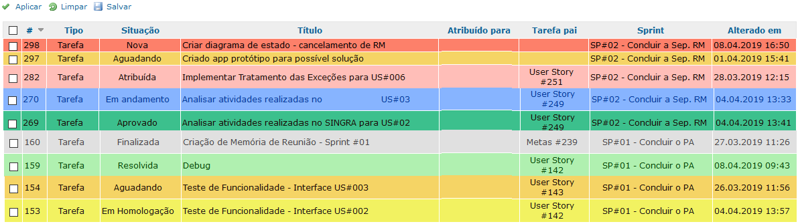

# redmine-color-tasks

Tema Redmine com cores nos status das tarefas, semelhante as cores das Tarefas do Mantis.

# Install

Para instalar o tema, basta acessar o diretório de temas do Redmine:

``` sh
# do it from redmine folder
cd public/themes
git clone https://github.com/carlosanders/redmine-color-tasks.git
```

Ou baixe o arquivo zip do site **github** e descompacte no diretório `themes`.
`${redmine}/public/themes/redmine-color-tasks`

# Configuração

Este tema sugere cores para os tipos de tarefas do Redmine e duas tarefas adicionais **Acknowledged** (7) e **Confirmed** (8). Tarefas adicionais podem ser adicionadas em **"Administração"> "Situação das tarefas"**.

Este tema simples concebido como sobrecarga do tema existente. Por padrão, ele sobrecarrega o tema **default** do Redmine.

Para ativar o tema, vá para **"Administração"> "Configurações"> "Exibir"** e selecione o tema **"Redmine-color-tasks"**

Um exemplo das tarefas com os status em cores:



# Sobrecarga

É possível sobrecarregar qualquer outro tema por edição do arquivo `application.css`. Simplesmente adicione a inclusão de `color_tasks.css` para o arquivo `application.css` do seu tema favorito.

``` css
/*
Para sobrecarregar qualquer tema basta adicionar à sua próxima linha application.css,
no início do arquivo (para pré-carregamento) ou no final (para sobreposição):
*/
@import url(../../redmine-color-tasks/stylesheets/color-tasks.css);
```

E vá para **"Administração"> "Configurações"> "Exibir"** e selecione apenas tema sobrecarregado com `application.css` modificado.